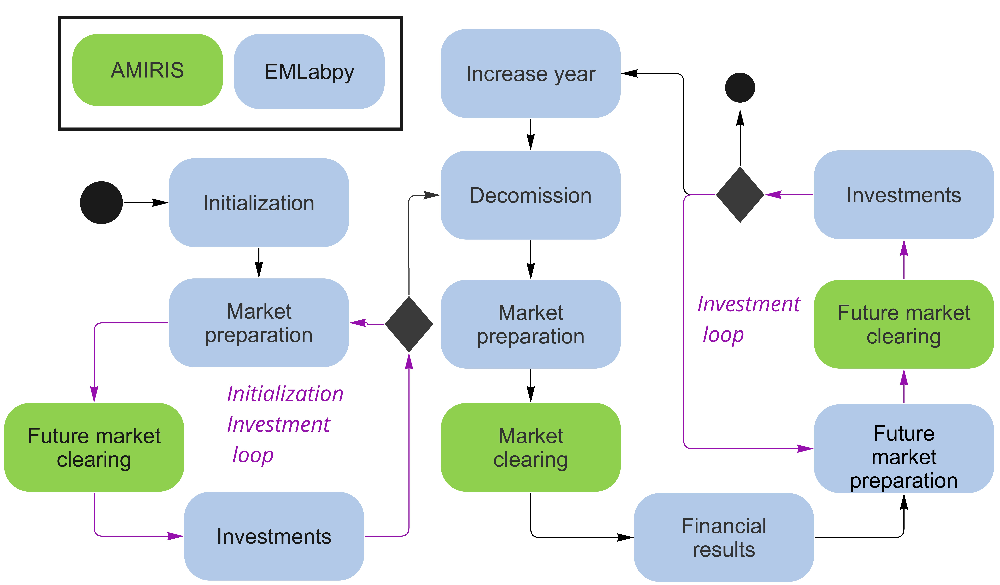

# EMLABpy - AMIRIS co-simulation using Spinetoolbox

The co-simulation of AMIRIS and EMLabpy intends to investigate the investment incentives in a future flexible power
system. EMLabpy is based in EMLab http://emlab.tudelft.nl/ and is rewritten in a modular way into python to run it partially. 

The co-simulation workflow is best illustrated with following diagram.


### Requirements
- Install Anaconda (not miniconda)
- Install Git https://git-scm.com/download/win
- Make sure that java 11 is installed

### 1. Prepare environments
To run this project, 3 anaconda environments (or any other virtual environment of your preference) should be created: emlabEnv, EMLabpy, Spinetoolbox

#### 1.1. EmlabEnv (AMIRIS)
emlabEnv include the packages to run AMIRIS

Open an anaconda prompt
In toolbox-amiris-emlab folder
```
conda env create -f environment.yml
conda activate emlabEnv
pip install -r requirements.txt
``` 
Close the command prompt

#### 1.2. EMLabpy
To run EMLabpy from the Spinetoolbox, it needs to be packed as a python module.
To do so, open an anaconda prompt and run the following commands in the toolbox-amiris-emlab folder
```
conda create -n emlabpy python=3.8
conda activate emlabpy
python setup.py install (Emlabpy has to be installed as a local module to be run in spinetoolbox)  
python -m pip install . 
pip install -r requirements.txt
```
close the command prompt

#### Updating Emlabpy

Whenever a code change occurs, including git pulls, it is necessary to update the EMLabpy environment.
For this, double-click the install_emlabpy.bat file.

#### 1.3. Spinetoolbox
Download spinetoolbox and install all requirements as their webpage indicated in:
https://github.com/spine-tools/Spine-Toolbox

Make a new anaconda environment called spinetoolbox. 

## 2. How to run it
In the toolbox-amiris-emlab folder activate the environment spinetoolbox.
(Type spinetoolbox to start the tool in this environment)

Once the project is open, make an emlabpy kernel as follows:
In spinetooolbox > file > settings> tools > jupyter console> kernel spec editor> add interpreter: path to the python.exe in your conda environment emlabpy
name: emlabpy
make kernel specification > ok

Also change the path on the (Amiris future tool > basic console) to the emlabEnv conda enviroment

Finally in Settings specify the path to toolbox-amiris-emlab

### Kernel
Once the environments emlabpy and emlabEnv have been created, generate kernels by double-clicking any tool in the tool specification editor.
Then, in the kernel spec editor, create a kernel that makes reference to the Anaconda environment.

### Run it
With the project open in spinetoolbox simply execute the project clicking the play symbol


### Rerun
If there have been any modifications to EMLabpy code, the emlabpy module has to be repacked and the databases have to be cleaned. 
To do so, double-click on the file
______update_emlabpy_SPINETOOLBOX.bat

### Data
The input data is stored in the data folder in following files:
The simulation configuration can be specified in the excel: Coupling Config.xlsx

The specifications for the EMLabpy modules (investment, capacity mechanism and CO2) should be added in : EMLAbparameters.xlsx

The power plants per country as saved in : Power_plants.xlsx

The technology and fuel costs are saved in: exported_traderes.xlsx

## Folder structure

### EMLABpy

#### `emlabpy/emlabpy.py`
This is the main Emlabpy file that activates the different modules depending on the arguments given through the spinetoolbox

#### `emlabpy/util/`
Data preparation scripts.

emlabpy/util/clock.py  - Prepares the data to simulate next year

emlabpy/util/sprinedb_reader_writer.py - Main functions to read and write data from DB into a repository.

emlabpy/util/spinedb.py - Wrapper of Spine DB API to modify data into the SQL Spinetoolbox database

emlabpy/util/repository.py - Functions to sort and modify data in repository.

#### `emlabpy/plots/domain`

Each EMLab agent is defined in the modules where also getters and setters are defined.

#### `emlabpy/plots/modules`
Each EMLabpy module retrieves information from the repository and executes a logic. For example, the capacity market, investment, prepare market clearing, etc.

#### `emlabpy/plots/`
emlabpy/plots/plots.py - Functions to create plots from DBs

### AMIRIS

#### `actions`

In these files are defined the functions to run AMIRIS and to rewrite the results into excels.

#### `amiris_workflow`

Here is the tool that imports all the needed data to run AMIRIS into yaml files. It also runs AMIRIS and exports the
data to files to be imported back to EMLAB.

#### `amiris_workflow/amiris`

The AMIRIS executable (amiris-core_2.0.0-alpha.13-jar-with-dependencies.jar) contains the latest code of the AMIRIS project https://gitlab.com/dlr-ve/esy/amiris/amiris/

The file amiris_workflow/amiris/results/traderes.pb contain the encrypted results.

#### `amiris_workflow/amiris/run.py`

This is the code being triggered in the workflow. Executing it, prepares the yaml files stored in the amiris-config

#### `amiris_workflow/amiris-config/data`
The excel timeseries (fuel prices, renewable profiles, demand, availability) to run AMIRIS are prepared runnning the emlabpy modules

#### `amiris_workflow/output`

The processed amiris_results.xls that will be used by EMLAB are saved here

### `preparation_scripts`

Contains miscellaneous scripts to prepare data

- delete_Spine_output_files.py -> delete log files of spinetoolbox
- CleanDB.py -> deletes the data in the main dqlite databases: EmlabDB and AMIRIS DB
- prepare power plants.py -> Groups the power plants per age.

### `logs`

The logging from all the workflow can be found in this folder

## License and Terms of Use 

The Spine Toolbox project example provided here can be used without any limitations. This does not apply to any data
files contained within or any parts of the models EMLabpy and AMIRIS.

The (Un)Licensing explicitly excludes:

    * Anything under "amiris", for which license of https://gitlab.com/dlr-ve/esy/amiris/amiris applies
    * Anything under "EMLABPY", for which MIT License applies
    * Any data contained in this repository.